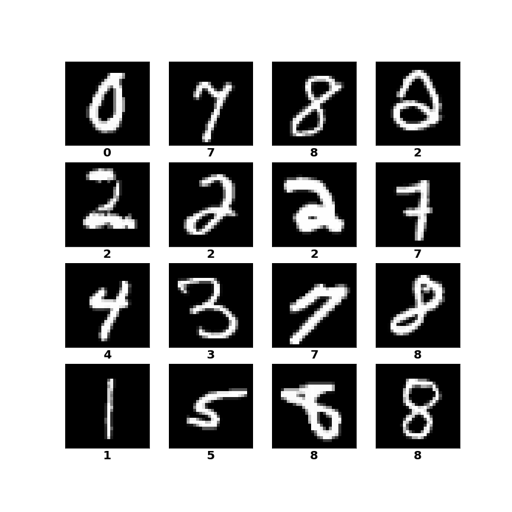

# Handwritten-Digit-Recognition
Deep learning model for handwritten digit recognition

Inception version 1 model is used. input shape and filters have been slightly altered to match the 28x28 shape of the images of the dataset.

[Original paper of inception v1](https://arxiv.org/pdf/1409.4842.pdf)

The dataset is from [this](https://www.kaggle.com/c/digit-recognizer) kaggle competition

There are 42000 images in the dataset, 35700 have been used for training, remaining ones for testing

Highest test accuracy: **99.49%**

The model architecture can be found [here](https://github.com/abdur-rafi/Handwritten-Digit-Recognition/blob/master/model_plot.png)

Some predictions:

